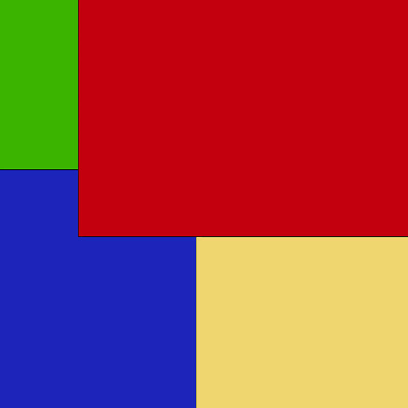
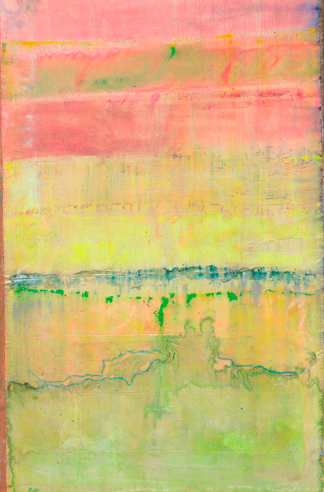
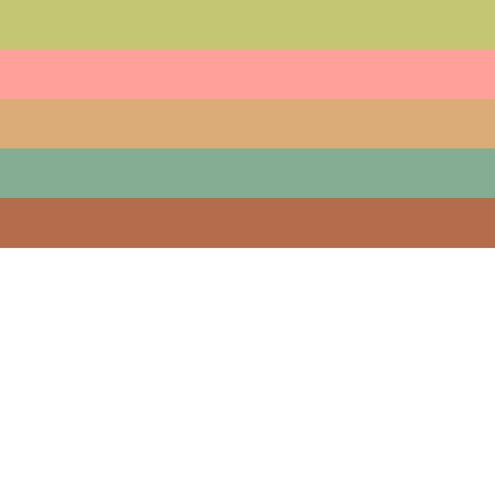

# Colour Extractor
This is a Ruby script that I wrote to extract the most common colours from an image

  1. Fetch the RGB values of every pixel
  2. Group them using the DeltaE(2000) algorithm
  3. Continue to combine the colours until at least 10 are found
  4. Colours that are less than 0.5% of the total are discarded

any questions? [just ask](https://github.com/johnpash)

---

## Pre-requisites
ImageMagick  
```bash
brew install imagemagick
```

---

## Running the app
```bash
bundle install
chmod +x app.rb
ruby ./app.rb https://images.pexels.com/photos/3844788/pexels-photo-3844788.jpeg

# this will create an `output.jpg` file
open output.jpg
```

## Options
**-p --proportional** ... This flag will show display output image bars in proportion to how often in the source image they appear

---

## Examples
|Input|Output|
|---|---|
|||
|||
|||
